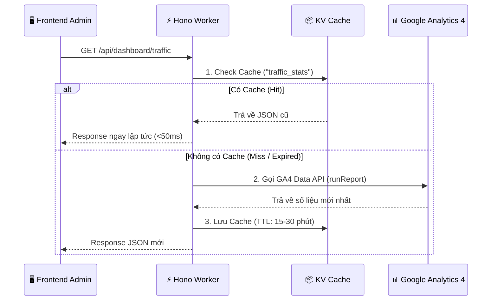

# 🦅 Hướng Dẫn Tích Hợp Hono Backend (Cloudflare) & Google Analytics

> **Tài liệu dành cho:** Backend Developer & DevOps
> **Mục tiêu:** Xây dựng API cung cấp dữ liệu Analytics cho Dashboard Admin mà không cần hạ tầng phức tạp.
> **Kiến trúc:** Cloudflare Workers (Hono) + Google Analytics 4 (GA4) + Cloudflare KV (Cache).

---

## 🏗 1. Kiến trúc Tổng quan (Architecture)

Quy trình hoạt động theo cơ chế **"On-Demand Realtime" (Thời gian thực theo yêu cầu)**:



### Tại sao dùng kiến trúc này?
1.  **Tiết kiệm**: Không tốn tiền server (Cloudflare Free Tier).
2.  **Tốc độ**: Tận dụng Edge Cache của Cloudflare.
3.  **Bảo mật**: Không lộ Service Account Key của Google xuống Frontend.

---

## 🔌 2. API Specification

Frontend yêu cầu 2 endpoint chính để render giao diện "Apple-style".

### A. Traffic Overview (Level 1)
*   **Endpoint**: `GET /api/dashboard/traffic`
*   **Mục đích**: Hiển thị 4 chỉ số sống còn (Users, Sessions, Views, Time) và biểu đồ xu hướng.

**Response JSON Structure:**

```json
{
  "overview": {
    "totalUsers": { "value": 1502, "trend": "up", "percent": 12 },
    "sessions": { "value": 3450, "trend": "up", "percent": 5 },
    "pageViews": { "value": 12450, "trend": "down", "percent": -2 },
    "avgEngagementTime": { "value": 185, "unit": "seconds", "trend": "stable" }
  },
  "trafficTrend": {
    "labels": ["Mon", "Tue", "Wed", "Thu", "Fri", "Sat", "Sun"],
    "values": [1200, 1500, 1300, 1700, 1600, 2000, 2400]
  }
}
```

### B. Content Performance (Level 2)
*   **Endpoint**: `GET /api/dashboard/content-performance`
*   **Mục đích**: Kết hợp dữ liệu bài viết (từ DB) với số liệu view (từ GA4) để biết bài nào đang hot.

**Response JSON Structure:**

```json
[
  {
    "id": "post_123",
    "title": "Cách sử dụng Vitamin C hiệu quả",
    "thumbnail": "https://images.unsplash.com/photo-...", // 📸 Quan trọng
    "category": "Sức khỏe",
    "status": "published",
    "publishedAt": "2024-03-20T10:00:00Z",
    "metrics": {
      "views": 5230,       // Sync từ GA4
      "avgTime": 180       // Giây
    }
  }
]
```

---

## 💻 3. Hướng dẫn Implement (Hono Code Snippet)

Dưới đây là mã mẫu để bạn bắt đầu ngay trong `src/index.ts` của Hono Worker.

### Setup Dependencies
```bash
npm install @google-analytics/data
```

### Code Demo

```typescript
import { Hono } from 'hono'
import { BetaAnalyticsDataClient } from '@google-analytics/data'

// Khởi tạo GA Client (Cần set biến môi trường GOOGLE_APPLICATION_CREDENTIALS)
const analyticsDataClient = new BetaAnalyticsDataClient()
const PROPERTY_ID = 'YOUR-GA4-PROPERTY-ID'

const app = new Hono()

app.get('/api/dashboard/traffic', async (c) => {
  // 1. Logic Cache với Cloudflare KV
  const cacheKey = 'dashboard_traffic_v1'
  // @ts-ignore
  const cachedData = await c.env.DASHBOARD_CACHE.get(cacheKey)
  
  if (cachedData) {
    return c.json(JSON.parse(cachedData))
  }

  // 2. Gọi GA4 Report
  const [response] = await analyticsDataClient.runReport({
    property: `properties/${PROPERTY_ID}`,
    dateRanges: [{ startDate: '7daysAgo', endDate: 'today' }],
    dimensions: [{ name: 'dayOfWeek' }],
    metrics: [{ name: 'activeUsers' }, { name: 'screenPageViews' }],
  })

  // 3. Transform Data (Map GA response -> FE Schema)
  const transformedData = {
    overview: {
      totalUsers: { value: 1200, trend: 'up', percent: 10 }, // Logic tính trend tự thêm
      // ...
    },
    trafficTrend: {
      labels: response.rows?.map(row => row.dimensionValues?.[0]?.value) || [],
      values: response.rows?.map(row => Number(row.metricValues?.[1]?.value)) || []
    }
  }

  // 4. Lưu Cache (15 phút = 900 giây)
  // @ts-ignore
  await c.env.DASHBOARD_CACHE.put(cacheKey, JSON.stringify(transformedData), { expirationTtl: 900 })

  return c.json(transformedData)
})

export default app
```

## 📝 Checklist trước khi Deploy

1.  **Google Cloud Platform**: Tạo Service Account, tải file JSON Key.
2.  **Cloudflare Dashboard**:
    *   Tạo KV Namespace tên `DASHBOARD_CACHE`.
    *   Bind KV vào Worker.
    *   Set biến môi trường (Secrets) cho Google Credentials.
3.  **GA4 Admin**: Share quyền "Viewer" cho email của Service Account.

---
*Tài liệu này được lưu tại `docs/HONO_GA_INTEGRATION.md`. Vui lòng cập nhật khi có thay đổi API.*
